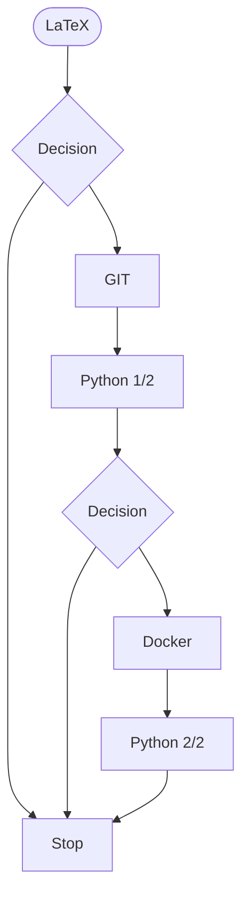

```mermaid
flowchart TD
  A(["LaTeX"]) --> B{"Decision"}
  B --> C["Stop"] & D["GIT"]
  D --> E["Python 1/2"]
  E --> F{"Decision"}
  F --> C
  F --> G["Docker"]
  G --> H["Python 2/2"]
  H --> C
```

<!--more-->
