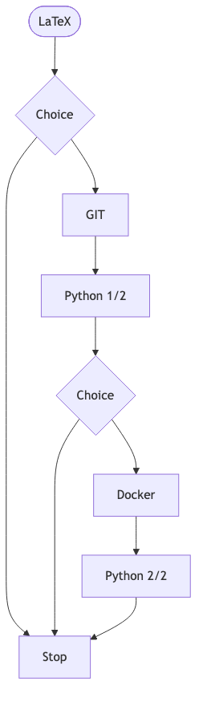

Welcome to our modular training series for PhD students, focused on the essential digital tools every researcher should master. Whether you’re writing a thesis, analyzing data, or managing code, these hands‑on sessions help you build solid foundations — at your own pace.

We’ve designed a progressive and flexible path, so you can stop when you’ve covered what you need, or continue deeper if you want to expand your skills.

⸻

📄 Step 1: LaTeX — Writing Like a Researcher

We begin with LaTeX, the standard for professional scientific writing. This session is ideal if you’re preparing articles, dissertations, or grant proposals and want full control over formatting, equations, and references.

You’ll learn:

-	The basic structure of a LaTeX document
-	Writing math, managing figures and tables
-	Bibliography management with BibTeX
-	Practical tips for clean, consistent documents

➡️ After this, you choose: stop here, or continue to expand your toolkit.

⸻

🔄 Step 2: Git — Version Control for Research Projects

Next, we introduce Git, the version control system used across research and industry. Git isn’t just for code — it helps you manage any evolving project, track changes, and collaborate efficiently.

In this session:

-	How Git tracks changes (commits, branches, merges)
-	Using GitHub and collaborative workflows
-	Good practices for transparent, reproducible work
-	Avoiding “final_version_revised_REALLY_FINAL.tex”

⸻

🐍 Step 3: Python 1/2 — Programming Essentials for Researchers

You don’t need to be a software engineer to use Python effectively. This first module emphasizes practical research tasks: data analysis, automation, and visualization.

You’ll explore:

-	Python syntax, variables, and control flow
-	Core data structures (lists, dictionaries, arrays)
-	Plotting and basic data processing (Matplotlib, NumPy)
-	Writing simple scripts to streamline your workflow

➡️ You can stop here if this covers your needs — or continue to strengthen your environment management skills.

⸻

🐳 Step 4: Docker — Reproducible Research Environments

Docker helps you encapsulate your entire research environment — code, dependencies, and configurations. If you’ve ever hit “it works on my machine,” this session is for you.

You’ll learn:

-	What containers are and how they work
-	Building and running Docker images
-	Strategies for portability and long‑term reproducibility
-	Using Docker alongside Python and scientific tools

⸻

🧠 Step 5: Python 2/2 — Advanced Tools and Best Practices

We go beyond the basics and focus on structuring code for real‑world research projects.

Topics include:

-	Organizing code with functions, modules, and simple packaging
-	Automating data processing and experiments
-	Working effectively with Jupyter notebooks
-	Overview of key libraries (pandas, SciPy, and more)

By the end, you’ll have a robust, efficient toolkit to support day‑to‑day research.

⸻

🧭 Choose Your Own Adventure

You can:

-	Take only the sessions you need
-	Follow the full track for a complete toolkit
-	Build confidence step by step — no prerequisites

🎓 Who Should Attend?

This series is open to all PhD students, especially those who:

-	Are new to research computing tools
-	Want to adopt best practices from the start
-	Need to improve their workflow for writing, coding, or collaboration

⸻

🛠️ Practical Information:

-	Format: Hands‑on workshops with real research examples
-	Level: Beginner‑friendly; no prior experience required
-	Bring your laptop — we’ll guide you step by step

⸻

Have questions or unsure where to begin? Contact us — we’ll help you design the path that fits your needs.

<!--more-->
